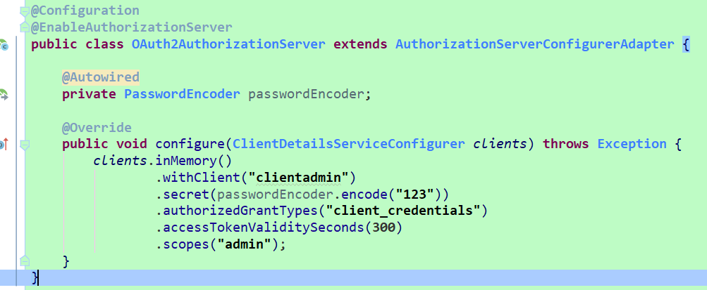
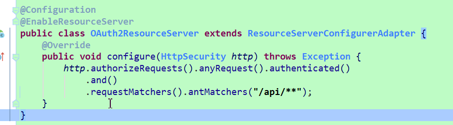

## Client Credentials Grant:客户端模式

post请求：

http://localhost:8080/oauth/token

参数名称 | 参数值 | 参数说明
---|--- |--- 
grant_type | client_credentials | 授权类型
Username | clientadmin | 放在Authorization,客户端的用户名
Password | 123 | 放在Authorization,客户端的密码
```
响应如下：
{
    "access_token": "0b18b42c-19d3-4689-9154-193b26433280",
    "token_type": "bearer",
    "expires_in": 2591992,
    "scope": "select"
}
```
---

说明：客户端模式只需要知道客户端的用户名和密码便能获取到正确的access_token，安全性较低，是四种模式中最简单的一种。

客户端模式虽然不需要用户的用户名和密码，但依然需要配置一个用户的用户名和密码，配置在application.properties中。

客户端模式可以配置多个客户端，可在内存中配置客户端，也可在数据库中配置客户端，配置客户端的地方如下图所示：




配置认证受保护的资源如图所示，/api/**下的资源需要access_token才能访问

