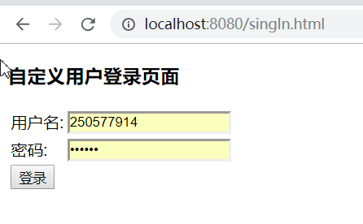
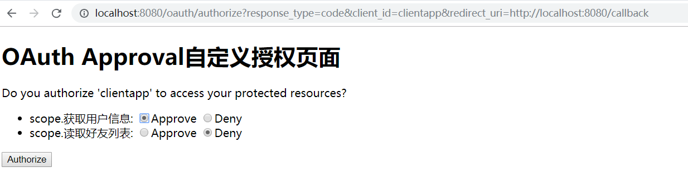
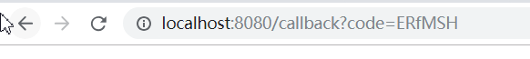

## Authorization Code Grant:授权码模式

首先，我们往授权中心发送如下请求 get请求：

http://localhost:8080/oauth/authorize?response_type=code&client_id=clientapp&redirect_uri=http://localhost:8080/callback

注意，此时response_type 的参数值为code ，而不是的token，

请求此url会提示用户输入用户名和密码，如下图所示：



用户登录成功后，会跳到授权页面，如下图所示：



用户同意授权之后重定向到下面的url，如下图所示：



http://localhost:8080/callback?code=ERfMSH

从回调的url中我们便能拿到正确的code

获取到授权码后code后需在10s内进行如下操作，一个code只能使用一次

post请求：

http://localhost:8080/oauth/token

参数名称 | 参数值 | 参数说明
---|--- |--- 
grant_type | authorization_code | 授权类型
code | ERfMSH | 授权码
client_id | clientapp | 客户端id
redirect_uri | http://localhost:8080/callback | 重定向的url
Username | clientapp | 放在Authorization,客户端的用户名
Password | 123456 | 放在Authorization,客户端的密码
返回示例：
```
{
    "access_token": "17a02bad-9e0c-4a1f-b1bd-41d5dddf52ed",
    "token_type": "bearer",
    "expires_in": 2591999,
    "scope": "app"
}
```

说明：授权码模式是四种授权模式中安全性最高，最完善，最好的模式之一。


