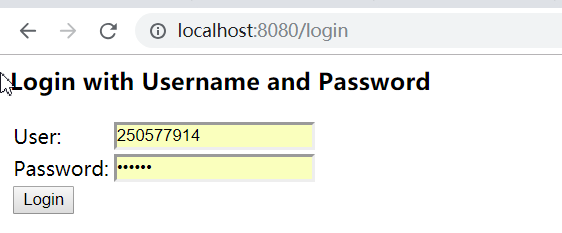
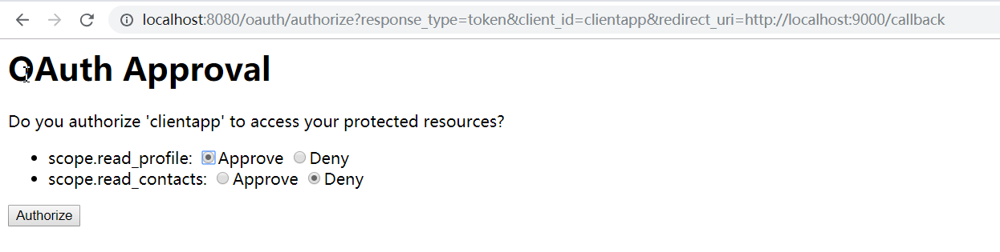
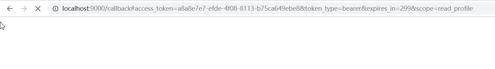

## Implicit Grant：简易模式

首先，我们往授权中心发送如下请求 get请求：

http://localhost:8080/oauth/authorize?response_type=token&client_id=clientapp&redirect_uri=http://localhost:9000/callback

注意，此时response_type 的参数值为token ，而不是的code，

请求此url会提示用户输入用户名和密码，如下图所示：

用户登录成功后，会跳到授权页面，如下图所示：

用户同意授权之后重定向到下面的url，如下图所示：

http://localhost:9000/callback#access_token=a8a8e7e7-efde-4f08-8113-b75ca649ebe8&token_type=bearer&expires_in=299&scope=read_profile

从回调的url中我们便能拿到正确的access_token,以及用户同意的权限scope=read_profile