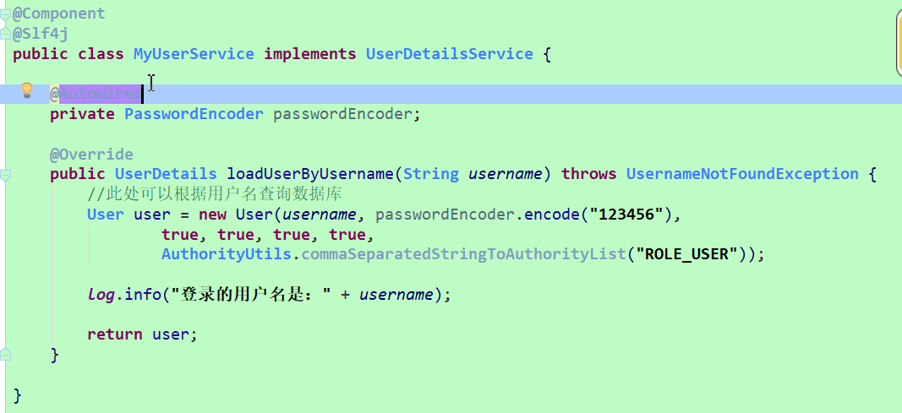
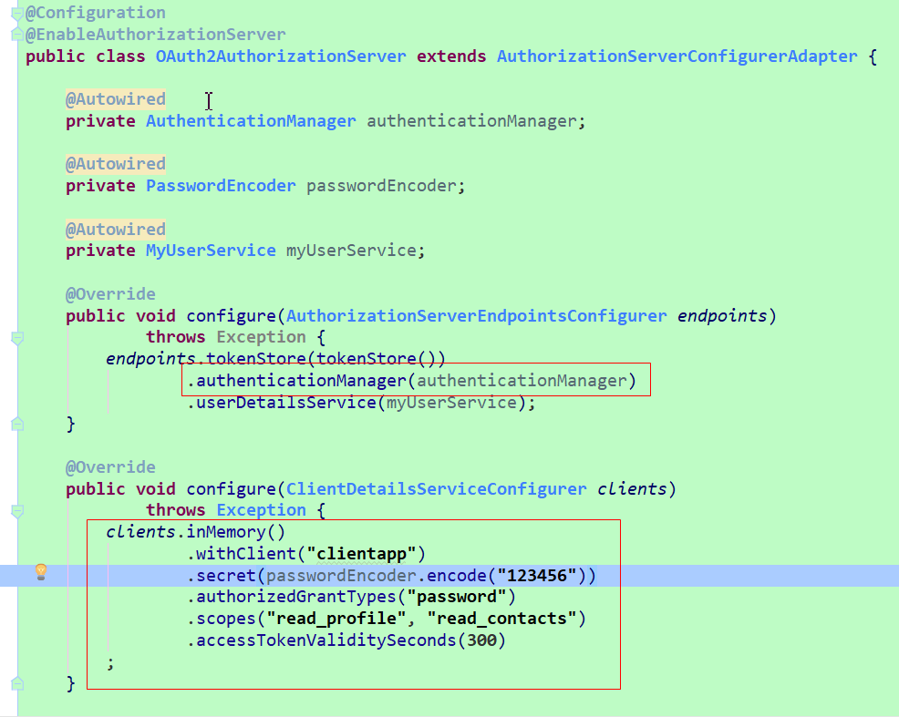
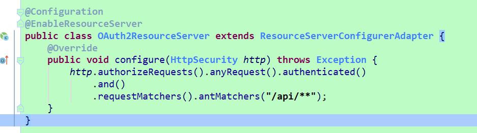

## Password Credentials Grant:密码模式

post请求：

http://localhost:8080/oauth/token

参数名称 | 参数值 | 参数说明
---|--- |--- 
grant_type | password | 授权类型
username | tom | 用户的用户名
password | 123456 | 用户的密码
Username | clientapp | 放在Authorization,客户端的用户名
Password | 123456 | 放在Authorization,客户端的密码

```
响应如下：
{
    "access_token": "393604c8-d2ec-44b8-b3d5-dfd124821d78",
    "token_type": "bearer",
    "expires_in": 2591999,
    "scope": "all"
}
```

---

说明：在使用密码模式时，用户（或者称为资源所有者）必须发送凭证（用户名，密码），而这些操作将会在客户端的掌控下。因此，在使用这种模式与客户端和服务端交互时，需要资源所有者必须十分信任客户端。例如，你作为资源所有者与facebook的官方客户端交互，之后有转为与facebook的服务端做交互。

密码模式中用户的配置在MyUserService中，如下图所示：



认证服务器中配置客户端如下图所示:



认证服务器中需要配置authenticationManager

资源服务器中拦截/api/**的请求，如下图所示：

